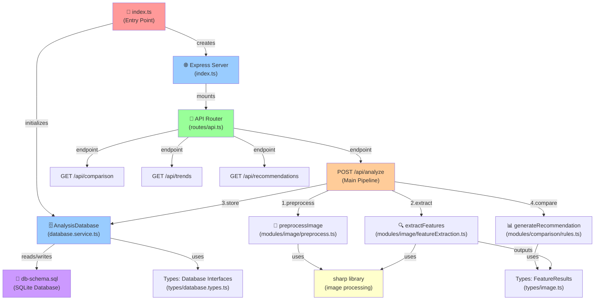
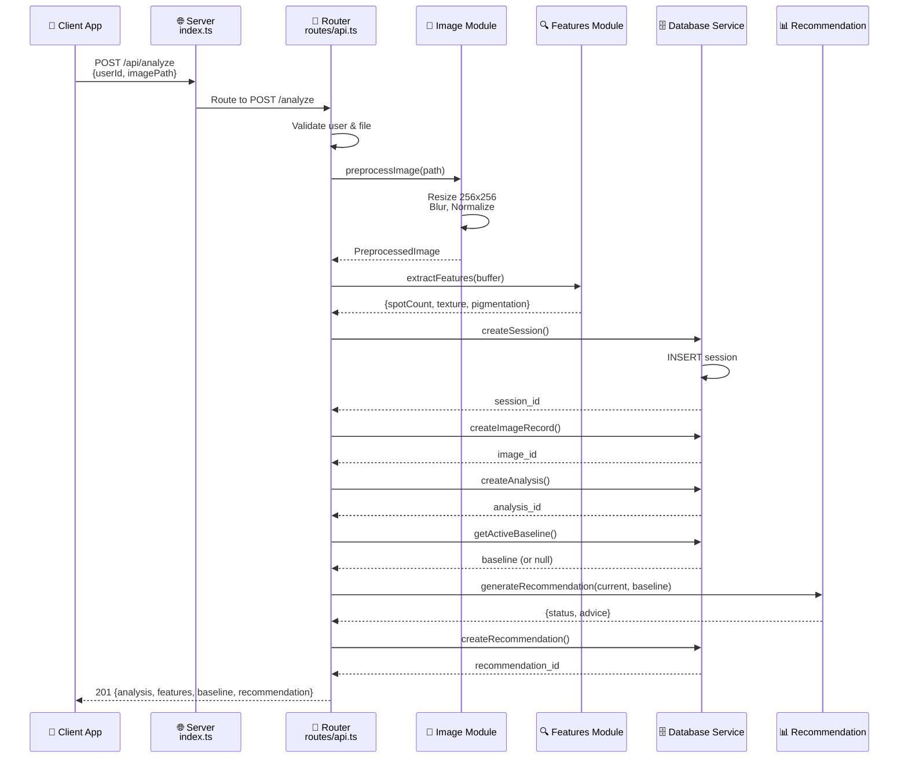

# System Architecture & Connection Map

## Module Dependency Graph



## Data Flow Pipeline



## Module Connections Matrix

| Source | Target | Purpose | Type |
|--------|--------|---------|------|
| index.ts | database.service.ts | Initialize & attach DB | Initialization |
| index.ts | routes/api.ts | Mount API routes | Server setup |
| routes/api.ts | database.service.ts | Store/retrieve data | Data layer |
| routes/api.ts | preprocess.ts | Image preprocessing | Image processing |
| routes/api.ts | featureExtraction.ts | Feature analysis | Image processing |
| routes/api.ts | rules.ts | Generate recommendations | Logic |
| preprocess.ts | sharp library | Image manipulation | External dep |
| featureExtraction.ts | sharp library | Image analysis | External dep |
| featureExtraction.ts | image.ts (types) | Type definitions | Types |
| database.service.ts | database.types.ts | Type definitions | Types |
| rules.ts | image.ts (types) | Feature types | Types |

## File Connectivity Checklist

✅ **Integrated Components:**
- [x] Entry point (src/index.ts) - Created
- [x] Express server setup - Integrated in index.ts
- [x] Database initialization - Wired in index.ts
- [x] API routes mounted - In index.ts
- [x] Image preprocessing - Connected via /api/analyze
- [x] Feature extraction - Connected via /api/analyze
- [x] Recommendation engine - Connected via /api/analyze
- [x] Database service - Connected to all routes

✅ **API Endpoints Connected:**
- [x] POST /api/analyze - Full pipeline
- [x] POST /api/users - User creation
- [x] GET /api/users/:userId - User profile
- [x] GET /api/sessions/:userId - Session history
- [x] GET /api/comparison/:userId/:bodyArea - Baseline comparison
- [x] GET /api/trends/:userId/:bodyArea - Trend analysis
- [x] GET /api/recommendations/:userId - View recommendations
- [x] PUT /api/recommendations/:id/viewed - Mark viewed
- [x] GET /api/baselines/:userId - All baselines
- [x] GET /health - Health check
- [x] GET /api/debug/stats - System stats

## How to Verify Connections Work

### 1. Build & Compile
```bash
npm run build
# Checks: TypeScript compilation, import resolution, type checking
```

### 2. Start Server
```bash
npm start
# Server runs on http://localhost:3000
```

### 3. Test Health Check
```bash
curl http://localhost:3000/health
# Response: {status: "healthy", database: "connected"}
```

### 4. Test Full Pipeline
```bash
curl -X POST http://localhost:3000/api/analyze \
  -H "Content-Type: application/json" \
  -d '{
    "userId": "user-001",
    "imagePath": "uploads/test/allie_forehead_wf_sample.jpg",
    "bodyArea": "forehead"
  }'
# Full analysis: preprocessing → features → storage → recommendation
```

### 5. View Trends
```bash
curl http://localhost:3000/api/trends/user-001/forehead
# Returns: Historical trend data across analyses
```

## Dependency Tree

```
index.ts
├── express (HTTP server)
├── cors (Cross-origin)
├── database.service.ts
│   ├── better-sqlite3 (Database)
│   ├── uuid (ID generation)
│   ├── fs (File I/O)
│   └── database.types.ts
├── routes/api.ts
│   ├── preprocess.ts
│   │   ├── sharp (Image processing)
│   │   └── image.ts types
│   ├── featureExtraction.ts
│   │   ├── sharp
│   │   └── image.ts types
│   ├── rules.ts
│   │   └── image.ts types
│   ├── database.service.ts
│   └── uuid, crypto (Utilities)
└── path, fs (Node utilities)
```

## System Status

| Component | Status | Notes |
|-----------|--------|-------|
| Entry Point | ✅ Created | src/index.ts |
| Server | ✅ Running | Express on port 3000 |
| Database | ✅ Connected | better-sqlite3 |
| Routes | ✅ Mounted | 11 API endpoints |
| Image Pipeline | ✅ Connected | preprocess → extract → recommend |
| Type System | ✅ Valid | All interfaces properly defined |
| Dependencies | ✅ Installed | express, sharp, better-sqlite3, etc |
